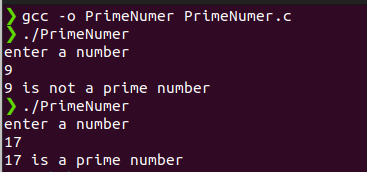

# 100DaysOfCProgramming - Day 7

## Program: Prime Number or not!

### Overview:
This is a simple C program to find a number is prime number or not
   
## How to Run

Make sure you have a C compiler installed on your system. You can compile and run the program using the following steps:

1. Open a terminal or command prompt.
2. Navigate to the directory containing the source code file (`PrimeNumber.c`).
3. Compile the program using a C compiler (`gcc -o PrimeNumber PrimeNumber.c`).
4. Run the compiled executable (`./PrimeNumber`).
5. The program will prompt you to enter a number.
6. The program will determine the number is prime numberrea or not.
7. The result will be displayed on the screen.

### Output

You should see the output:

Happy coding! 🚀
