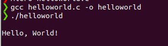

# Hello, World! in C

Welcome to my C programming repository! This simple project includes the classic "Hello, World!" program written in C.

## How to Run

Make sure you have a C compiler installed on your system. You can compile and run the program using the following steps:

1. Open a terminal or command prompt.
2. Navigate to the directory containing the source code file (`helloworld.c`).
3. Compile the program using a C compiler (`gcc helloworld.c -o helloworld`).
4. Run the compiled executable (`./helloworld`).

You should see the output:

Feel free to explore the code and experiment with different ways to output the classic greeting in C.

Happy coding! 🚀
