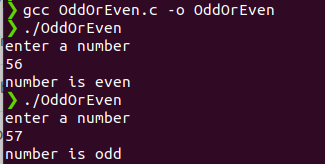

# 100DaysOfCProgramming - Day 2

## Program: Check a number, Even or Odd

### Overview:
This is a simple C program that takes a user input, checks if it's an even or odd number, and prints the result.
   
## How to Run

Make sure you have a C compiler installed on your system. You can compile and run the program using the following steps:

1. Open a terminal or command prompt.
2. Navigate to the directory containing the source code file (`OddOrEven.c`).
3. Compile the program using a C compiler (`gcc OddOrEven.c -o OddOrEven`).
4. Run the compiled executable (`./OddOrEven`).
5. The program will prompt you to enter a number.
6. The program will determine if the entered number is even or odd.
7. The result will be displayed on the screen.

### Output

You should see the output:

Happy coding! 🚀
