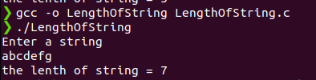

# 100DaysOfCProgramming - Day 3

## Program: find lenth of a string

### Overview:
This is a simple C program that takes a string and find its length and prints the result.
   
## How to Run

Make sure you have a C compiler installed on your system. You can compile and run the program using the following steps:

1. Open a terminal or command prompt.
2. Navigate to the directory containing the source code file (`LengthOfString.c`).
3. Compile the program using a C compiler (`gcc -o LengthOfString LengthOfString.c`).
4. Run the compiled executable (`./LengthOfString`).
5. The program will prompt you to enter a string.
6. The program will calculate the length of that string.
7. The result will be displayed on the screen.

### Output

You should see the output:

Happy coding! 🚀
