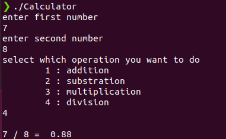

# 100DaysOfCProgramming - Day 4

## Program: Simple Calculator

### Overview:
This is a simple calculator program in C.
   
## How to Run

Make sure you have a C compiler installed on your system. You can compile and run the program using the following steps:

1. Open a terminal or command prompt.
2. Navigate to the directory containing the source code file (`Calculator.c`).
3. Compile the program using a C compiler (`gcc -o Calculator Calculator.c`).
4. Run the compiled executable (`./Calculator`).
5. The program will prompt you to enter two numbers and operator
6. The program will calulate the result.
7. The result will be displayed on the screen.

### Usage Instructions:
1. Enter the first number.
2. Enter the second number.
3. Choose the operation (1 for addition, 2 for subtraction, 3 for multiplication, 4 for division).
4. The program will display the result.

### Output

You should see the output:

Happy coding! 🚀
